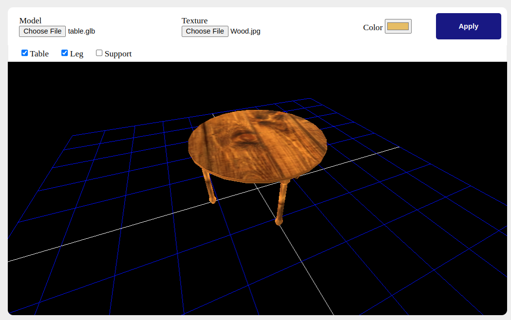
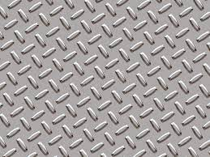
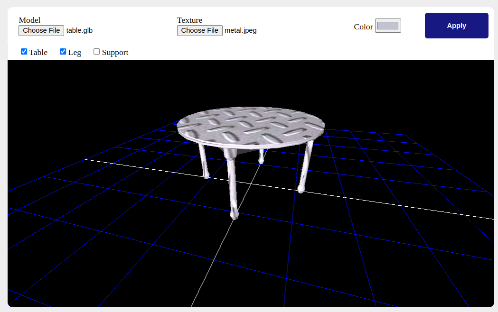
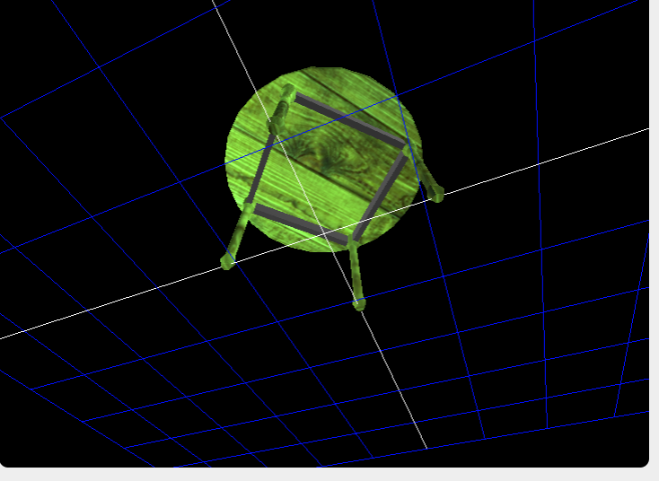
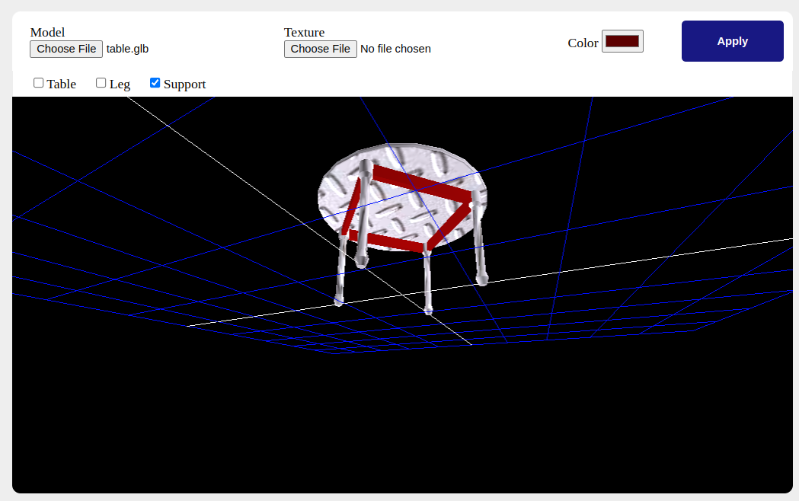

This project is to demonstrate the ability to change the 3D models on the browser, so that we can have multiple variations of the object.
Which's very usefull in imagination process of the final output.

[Try it Here](https://configure-3d-models.netlify.app/)!

----------------

|      Material     |       Result       |
|-------------------|--------------------|
|    |   |
|  |  |

----------------

Or we can creat different combinations as we can select one or more parts to be changed once.

| Green Color & Wood Material | Red Support & Metalic Legs |
|-----------------------------|----------------------------|
|        |      |
